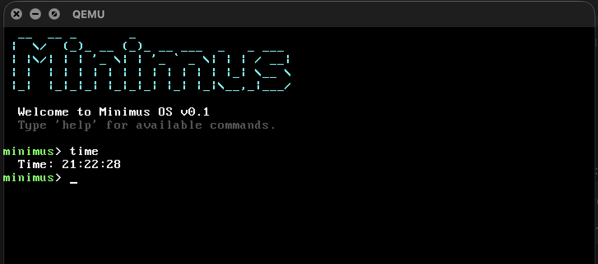

# Minimus OS

Minimus OS is a minimal, 32-bit x86 operating system built from scratch using C and x86 Assembly. Designed as an educational project, it operates in 32-bit Protected Mode and provides a fundamental system environment including a kernel, basic hardware drivers, and an interactive command-line interface.

## Architecture and Features

*   **Boot and Kernel**: Operates in 32-bit Protected Mode.
*   **Video Subsystem**: Custom VGA text-mode driver supporting color output and basic screen manipulation (clearing, scrolling, hardware cursor).
*   **Input Subsystem**: Basic PS/2 keyboard driver for synchronous character input.
*   **System Time**: Real-Time Clock (RTC) integration via CMOS to retrieve the current system time and date.
*   **Hardware Control**: ACPI/keyboard controller integration for system reboot capabilities.

## Interactive Shell

Minimus OS boots directly into an interactive shell environment that provides the following utilities:

*   `help`: Displays a list of available commands.
*   `clear`: Clears the VGA text buffer.
*   `echo`: Outputs the provided arguments to the screen.
*   `time`: Retrieves and formats the current time from the RTC.
*   `date`: Retrieves and formats the current date from the RTC.
*   `about`: Displays system version and build information.
*   `reboot`: Issues a hardware reset to restart the machine.

